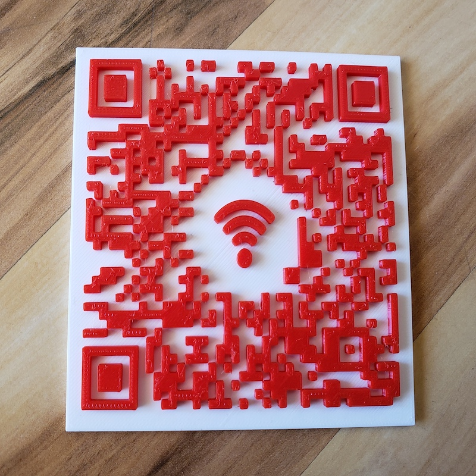

# QR Code STL Generator



## About

I wanted to print a QR code for home guests to be able to connect to my wifi without me having to write down the password for them. I couldn't find any STL generators for QR codes, so I decided to make one using Python and Blender.

While I designed this with Wifi and 3d printing in mind, you could change the icon to something like a website icon or logo and then insert a URL instead of Wifi credentials. Even if you don't have a printer, you can use the `files/qr.png` image that is generated and hang it up at home or hand it out. 

## Requirements

* [Python 3](https://www.python.org/)
    - `pip3 install -r requirements.txt`

* [Blender 2.8](https://www.blender.org/)

## Usage

### Setup

For the quickest setup, just put your Blender path and wifi information into `qr.py` with a text editor. If you want to configure the STL generation, use the following options:

* `qr.py`
    - `blender_path`: Path to blender program. On MacOS this is something like `/Applications/Blender.app/Contents/MacOS/Blender`. Defaults for other operating systems are in the script
    - `auth_type`: Wifi auth type, valid inputs are `WPA`, `WEP`, and empty
    - `ssid`: Name of your Wifi network    
    - `password`: Password for Wifi network. This all runs locally, but keep in mind that if someone can see your QR code they can also extract the password

* `qr_blend.py`
    - `svg_path`: Path to QR code SVG file, default is fine if you're using the built-in SVG generator
    - `icon_path`: Path to SVG of center icon
    - `output_path`: Where you want the resulting STL to go
    - `icon_radius`: How big to make space for the center icon, this should be small (0.005 - 0.02)
    - `qr_height`: Height in mm to make the 'black' part of the QR code
    - `icon_height`: Height in mm to make the icon
    - `base_height`: Height in mm to make the 'white' part of the QR code
    - `qr_length`: Length in mm of the code portion
    - `icon_length`: Length in mm of the center icon
    - `base_length`: Length in mm of the base

* In `qr_img.py`The amount of redundancy can be adjusted which allows for things such as icons and such. However, to reduce the density of the code this can be lowered if desired:
    - `ERROR_CORRECT_L`: About 7% or less errors can be corrected.
    - `ERROR_CORRECT_M`: About 15% or less errors can be corrected.
    - `ERROR_CORRECT_Q`: About 25% or less errors can be corrected.
    - `ERROR_CORRECT_H`: About 30% or less errors can be corrected.

The scripts have other things you can tweak if you wanna dig into it, and I may add more options if it turns out people want some more.

### Running

If all of the dependecies are installed correctly and the Blender path is correct, running is as simple as:

```
python3 qr.py
```

The STL will end up in the current directory by default. A PNG will also be generated at `files/qr.png`. 

### Printing

PrusaSlicer is what I use to slice my prints and it has a really cool feature that allows you to pause prints at a certain layer to change filaments. Simply import the STL, set the layer where you wanna swap, then the printer will pause at that layer and allow for a filament swap. I'm told that other slicers like Cura also have this feature.

#### Multi-Color Printing

I don't have a multi-color printer, but I attempted to implement an option that would generate three different STLs so that they can be printed in different colors within the same layer. To enable this, set `multi = True` in `qr_blend.py`. If you try it, please let me know if it works or not!

## Troubleshooting

* Make sure you're using 3.x
* Make sure you're using Blender 2.8x

If you run into other issues, feel free to email me at lukerindels98@hotmail.com

